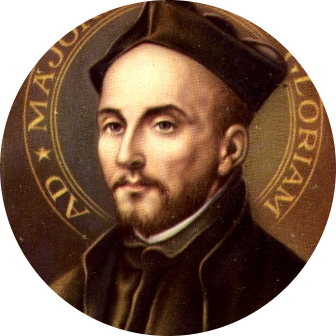

# Bot Jesuita. Clon de ChatGPT hecho con [Vite](https://vitejs.dev/) Vainilla JS y OPENAI API

<!-- insert image lad-icon located in public -->



## ¿Qué es esto?

Este es un clon jesuita de [ChatGPT](https://chat.openai.com/chat) hecho con Vainilla JS y OPENAI API.

## ¿Cómo funciona?

El proyecto usa la API de OpenAI para generar respuestas a partir de un contexto. El contexto es el texto que el usuario escribe en el chat, además de un preámbulo jesuita.

## AWP

Este es unA AWP. Siéntase libre de instalarlo. Para lograr esto, se usa [Workbox](https://developer.chrome.com/docs/workbox/).

## ¿Cómo instalarlo?

```bash
npm install
```

## ¿Cómo ejecutarlo?

```bash
npm run dev
```

## ¿Cómo generar los iconos?

```bash
npx pwa-asset-generator <your-desired-image> icons
```

Por supuesto, necesitarás cambiar el `manifest.json` como el siguiente paso.
